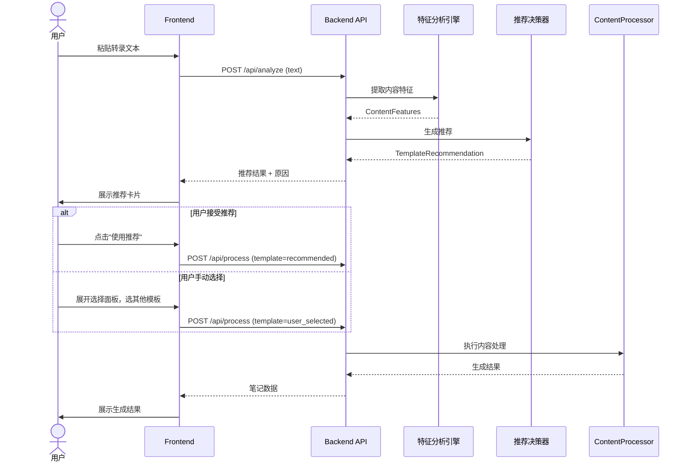

# 播客笔记模板风格智能推荐与自选系统 — 产品设计与实施方案

> **文档版本**：V1.0  
> **撰写日期**：2026-06-01  
> **文档状态**：待评审  
> **对应 PRD**：podcast-to-xhs-prd.md（V1.0）

---

## 一、产品定位与价值主张

### 1.1 功能定位

**模板风格智能推荐与自选系统**是播客笔记 V1.1 版本的核心体验升级模块。它解决当前系统"模板选择黑盒化"的痛点——用户无法感知 10 种模板的差异，也无法控制输出风格。

**一句话描述**：让每一期播客都找到最适合它的"笔调"，让用户在"省心"与"掌控"之间自由切换。

### 1.2 核心价值

| 维度 | 当前痛点 | 解决后价值 |
|------|---------|-----------|
| **控制感** | 前端硬编码 v9，用户无选择权 | 用户可自主选择或覆盖系统推荐 |
| **认知负担** | 10 个技术别名（v1-v9）无法理解 | 人话命名 + 场景化描述，降低决策成本 |
| **输出质量** | 一种模板打天下，适配性不足 | 内容特征驱动推荐，匹配度提升 |
| **学习效率** | 新用户不知道哪个模板适合自己 | 推荐系统提供默认锚点，渐进式探索 |

### 1.3 与现有系统的关系

```
现有核心链路（不变）
├── 音频输入 → 语音转写 → 内容理解（章节/要点/金句/标签）
└── 笔记生成 → 质量检查 → 输出保存

新增模块（本方案）
├── 内容特征分析引擎（轻量级）
├── 模板推荐决策器
├── 用户自选交互层
└── 推荐反馈与学习（Phase 2）
```

---

## 二、用户需求分析

### 2.1 用户画像与场景

#### 用户 A：知识型内容创作者（核心用户）

**场景 1：快速生产**
> 小林每周要发 3-5 篇笔记，她希望系统默认就能给出高质量输出，不需要每次纠结选哪个模板。当系统推荐"深度分析型"时，她一键接受，5 分钟后拿到可直接发布的图文。

**场景 2：风格实验**
> 同一期播客，她想试试"故事共鸣型"和"干货清单型"哪个在小红书表现更好。系统支持她快速切换模板对比输出。

**场景 3：精准控制**
> 她明确知道这期是投资方法论类内容，想要"知识翻译官型"的通俗化表达，直接手动选择，不接受系统推荐。

#### 用户 B：播客重度听众（次级用户）

**场景：首次使用**
> 小张第一次用播客笔记，上传了一期商业类播客。系统分析后推荐"深度分析型"，并告诉他"检测到丰富的时间线和数据，适合阶段化分析"。他觉得合理，点击生成。

#### 用户 C：研究人员

**场景：批量处理**
> 研究员需要处理 20 期播客，希望系统能自动为每期选择最合适的模板，减少人工干预。

### 2.2 需求优先级矩阵

| 需求 | 用户群体 | 频率 | 价值 | 优先级 |
|------|---------|------|------|-------|
| 系统智能推荐默认模板 | 所有用户 | 高 | 高 | P0 |
| 用户手动选择/覆盖模板 | 创作者、研究员 | 高 | 高 | P0 |
| 推荐原因说明 | 新用户 | 中 | 高 | P0 |
| 模板效果预览/对比 | 创作者 | 中 | 中 | P1 |
| 历史偏好学习 | 所有用户 | 低 | 中 | P2 |
| 批量自动推荐 | 研究员 | 低 | 中 | P2 |

---

## 三、功能模块划分

### 3.1 模块架构

```
模板风格推荐与自选系统
├── 模块 A：内容特征分析引擎（后端）
│   ├── 文本特征提取器
│   ├── 特征向量化
│   └── 置信度评估
├── 模块 B：模板推荐决策器（后端）
│   ├── 决策规则引擎
│   ├── 推荐结果组装
│   └── 原因生成器
├── 模块 C：模板管理服务（后端）
│   ├── 模板元数据注册
│   ├── 别名映射管理
│   └── 模板能力描述
├── 模块 D：风格选择交互组件（前端）
│   ├── 智能推荐展示
│   ├── 风格选择面板
│   ├── 模板详情预览
│   └── 用户确认/覆盖流程
└── 模块 E：推荐反馈收集（前端+后端）
    ├── 用户选择记录
    ├── 满意度反馈
    └── 数据上报（Phase 2）
```

### 3.2 模块详细设计

#### 模块 A：内容特征分析引擎

**职责**：对输入的转录文本进行轻量级特征提取，为推荐决策提供数据支撑。

**特征维度**：

| 特征名称 | 提取方式 | 权重 | 说明 |
|---------|---------|------|------|
| 时间线密度 | 正则匹配年份/时间段 | 高 | 判断是否为历史/商业演进类内容 |
| 数据密度 | 匹配数字、百分比、金额 | 高 | 判断信息密度和数据支撑程度 |
| 概念/术语密度 | 匹配专业词汇、方法论 | 中 | 判断是否需要通俗化翻译 |
| 对话/叙事密度 | 匹配引语、故事标记 | 中 | 判断是否为访谈/故事类内容 |
| 情感表达密度 | 匹配情感词、感叹 | 低 | 判断是否需要情感共鸣型 |
| 文本长度 | 字符数统计 | 低 | 判断内容量，影响信息密度 |

**输出格式**：

```python
class ContentFeatures(BaseModel):
    """内容特征向量."""
    time_line_density: float      # 0-1，时间线密度
    data_density: float           # 0-1，数据密度
    concept_density: float        # 0-1，概念密度
    narrative_density: float      # 0-1，叙事密度
    emotional_density: float      # 0-1，情感密度
    text_length: int              # 文本长度
    confidence: float             # 特征提取置信度
```

#### 模块 B：模板推荐决策器

**职责**：基于内容特征，通过决策规则输出推荐模板及原因。

**决策规则（启发式）**：

```
IF 时间线密度 > 0.6 AND 数据密度 > 0.5:
    → 推荐 "深度分析型" (v9)
    → 原因: "检测到丰富的时间线和数据，适合阶段化分析"

ELIF 对话密度 > 0.7 AND 时间线密度 < 0.3:
    → 推荐 "凝练文稿型" (v8)
    → 原因: "对话感强，适合保留原播客结构"

ELIF 概念密度 > 0.6:
    → 推荐 "知识翻译官" (v7)
    → 原因: "专业概念密集，适合通俗化解读"

ELIF 叙事密度 > 0.6:
    → 推荐 "故事共鸣型" (v6)
    → 原因: "故事性强，适合叙事化呈现"

ELIF 数据密度 > 0.4 AND 概念密度 < 0.3:
    → 推荐 "干货清单型" (v5)
    → 原因: "信息密度高，适合条目化呈现"

ELSE:
    → 推荐 "深度分析型" (v9)
    → 原因: "通用场景，结构化分析"
```

**输出格式**：

```python
class TemplateRecommendation(BaseModel):
    """模板推荐结果."""
    recommended_template: str     # 推荐模板别名
    recommended_name: str         # 人话名称
    confidence: float             # 推荐置信度
    reason: str                   # 推荐原因（用户可见）
    features: ContentFeatures     # 分析的特征数据
    alternatives: list[str]       # 备选模板（按匹配度排序）
```

#### 模块 C：模板管理服务

**职责**：统一管理模板元数据，消除技术别名，提供人话描述。

**模板注册表**：

| 别名 | 人话名称 | 一句话描述 | 适用场景标签 | 输出格式 |
|------|---------|-----------|-------------|---------|
| v9 | 深度分析型 | 时间线+阶段划分+标签化，信息密度最高 | 商业、历史、投资、深度访谈 | stages JSON |
| v8 | 凝练文稿型 | 忠于播客原结构，删减口语化内容 | 对话、访谈、纪实 | sections JSON |
| v7 | 知识翻译官 | 用生活类比解释专业概念 | 科普、方法论、概念解读 | key_points JSON |
| v7d | 图文高密度型 | 信息密度更高的图文排版 | 内容量大、信息密集 | key_points JSON |
| v6 | 故事共鸣型 | 叙事驱动，强调情感共鸣 | 个人成长、情感、故事 | key_points JSON |
| v5 | 干货清单型 | 条目化呈现，actionable | 技巧、工具、清单 | 文字笔记 |
| v4 | 真人笔记型 | 降低 AI 感，像真人手写 | 追求真实感、去 AI 化 | 文字笔记 |
| v3 | 故事共鸣型（旧） | 情感驱动、引发共鸣 | 生活/情感类 | 文字笔记 |
| v2 | 深度干货型（旧） | 知识密集、逻辑严密 | 商业/科技/理财 | 文字笔记 |
| v1 | 标准型（旧） | 平衡信息量与可读性 | 通用场景 | 文字笔记 |

#### 模块 D：风格选择交互组件

**职责**：前端交互层，展示推荐结果，支持用户选择/覆盖。

**交互流程**：

```
用户粘贴转录文本
    ↓
[实时分析中...]（可选，文本>500字时触发）
    ↓
显示智能推荐卡片
┌─────────────────────────────────────────┐
│  🎯 系统推荐：深度分析型                  │
│     适合：商业/历史/投资类内容             │
│     原因：检测到丰富的时间线和数据          │
│                                         │
│  [✓ 使用推荐]  [选择其他风格 ▼]          │
└─────────────────────────────────────────┘
    ↓
用户确认或切换
    ↓
生成笔记
```

**风格选择面板设计**：

```
选择笔记风格
├── 推荐（1个）
│   └── 深度分析型 ★推荐
│       "适合时间线丰富、数据密集的内容"
├── 图文笔记（3个）
│   ├── 深度分析型 — 阶段+标签+因果链
│   ├── 凝练文稿型 — 忠于原播客结构
│   └── 知识翻译官 — 类比+大白话
├── 文字笔记（6个）
│   ├── 干货清单型
│   ├── 真人笔记型
│   ├── 故事共鸣型
│   └── ...
└── 对比预览（P1）
```

#### 模块 E：推荐反馈收集（Phase 2）

**职责**：收集用户行为数据，为后续优化推荐算法提供依据。

**收集数据**：
- 用户是否接受推荐
- 用户最终选择的模板
- 用户切换模板的次数
- 用户对输出的满意度（可选评分）

---

## 四、核心业务流程设计

### 4.1 主流程：智能推荐 + 用户确认



### 4.2 子流程：内容特征分析

```
输入：转录文本（字符串）
输出：ContentFeatures

步骤：
1. 文本预处理（去除空行、标准化）
2. 时间线密度计算
   - 匹配模式：r'\d{4}年?'、r'(20\d{2}|19\d{2})'
   - 密度 = 匹配数 / 总句子数
3. 数据密度计算
   - 匹配模式：r'\d+%'、r'\d+万'、r'\d+亿'、r'\d+\.\d+'
   - 密度 = 匹配数 / 总句子数
4. 概念密度计算
   - 关键词库：理论、模型、框架、原则、方法论、效应、定律
   - 密度 = 匹配数 / 总句子数
5. 叙事密度计算
   - 匹配模式：说、认为、提到、分享、故事、经历、回忆
   - 密度 = 匹配数 / 总句子数
6. 情感密度计算
   - 情感词库（正面/负面/惊讶）
   - 密度 = 匹配数 / 总句子数
7. 计算整体置信度
   - 基于文本长度（>1000字置信度高）
8. 返回 ContentFeatures
```

### 4.3 子流程：模板推荐决策

```
输入：ContentFeatures
输出：TemplateRecommendation

步骤：
1. 初始化备选列表（所有模板）
2. 按决策规则计算每个模板的匹配分数
3. 选择分数最高的模板作为推荐
4. 生成推荐原因（基于触发的规则）
5. 计算置信度（基于特征区分度）
6. 组装备选列表（Top 3）
7. 返回 TemplateRecommendation
```

### 4.4 异常处理流程

| 异常场景 | 处理方式 | 用户提示 |
|---------|---------|---------|
| 文本过短（<200字） | 跳过分析，默认推荐 v9 | "文本较短，使用默认模板" |
| 特征提取失败 | 使用默认推荐 | "分析失败，使用默认模板" |
| 推荐置信度过低（<0.5） | 推荐 + 提示用户确认 | "内容特征不明显，请确认选择" |
| 用户选择的模板不存在 | 返回错误 | "模板不存在，请重新选择" |

---

## 五、技术架构选型

### 5.1 后端架构

```
backend/routers/
├── analyze.py          # 新增：内容分析 API
│   ├── POST /analyze   # 分析文本特征并推荐模板
│   └── GET /templates  # 获取所有模板元数据
├── process.py          # 修改：支持 template 参数动态传递
└── ...

core/
├── content_processor.py    # 修改：集成推荐逻辑
├── template_recommender.py # 新增：推荐决策器
│   ├── ContentAnalyzer     # 特征分析引擎
│   ├── RecommendationEngine # 决策规则引擎
│   └── TemplateRegistry    # 模板注册表
└── ...

models/
├── template.py         # 新增：模板相关数据模型
│   ├── ContentFeatures
│   ├── TemplateRecommendation
│   └── TemplateMetadata
└── ...
```

### 5.2 前端架构

```
web-dashboard/src/
├── app/dashboard/create/
│   ├── page.tsx                    # 修改：集成风格选择
│   ├── ContentProcessor.tsx        # 修改：添加推荐展示和选择逻辑
│   └── TemplateSelector.tsx        # 新增：风格选择组件
├── components/
│   ├── template/
│   │   ├── SmartRecommendation.tsx # 新增：智能推荐卡片
│   │   ├── TemplateCard.tsx        # 新增：单个模板展示卡片
│   │   └── TemplateGrid.tsx        # 新增：模板网格列表
│   └── ...
├── lib/
│   ├── api.ts                      # 修改：添加 analyze API 调用
│   └── templates.ts                # 新增：模板常量与描述
└── ...
```

### 5.3 API 设计

#### 新增 API：内容分析

```http
POST /api/analyze
Content-Type: application/json

{
  "transcript_text": "string",  // 转录文本
  "podcast_name": "string",     // 播客名称（可选）
  "episode_title": "string"     // 单集标题（可选）
}

Response:
{
  "success": true,
  "recommendation": {
    "recommended_template": "v9",
    "recommended_name": "深度分析型",
    "confidence": 0.85,
    "reason": "检测到丰富的时间线和数据，适合阶段化分析",
    "features": {
      "time_line_density": 0.72,
      "data_density": 0.65,
      "concept_density": 0.45,
      "narrative_density": 0.30,
      "emotional_density": 0.20,
      "text_length": 3500,
      "confidence": 0.90
    },
    "alternatives": ["v8", "v7"]
  }
}
```

#### 修改 API：内容处理

```http
POST /api/process
Content-Type: application/json

{
  "transcript_text": "string",
  "template": "v9",              // 改为可选，不传时使用推荐
  "podcast_name": "string",
  "episode_title": "string",
  "allow_auto_recommend": true   // 是否允许自动推荐
}

Response:
{
  "success": true,
  "note": { ... },
  "used_template": "v9",         // 新增：实际使用的模板
  "recommendation_info": {        // 新增：推荐信息（如果是自动推荐）
    "was_recommended": true,
    "reason": "检测到丰富的时间线和数据"
  }
}
```

#### 新增 API：获取模板列表

```http
GET /api/templates

Response:
{
  "success": true,
  "templates": [
    {
      "alias": "v9",
      "name": "深度分析型",
      "description": "时间线+阶段划分+标签化，信息密度最高",
      "category": "图文笔记",
      "tags": ["商业", "历史", "投资"],
      "output_format": "stages_json"
    }
  ]
}
```

### 5.4 数据模型

```python
# models/template.py

from pydantic import BaseModel, Field
from typing import Literal

class ContentFeatures(BaseModel):
    """内容特征向量."""
    time_line_density: float = Field(0.0, ge=0.0, le=1.0)
    data_density: float = Field(0.0, ge=0.0, le=1.0)
    concept_density: float = Field(0.0, ge=0.0, le=1.0)
    narrative_density: float = Field(0.0, ge=0.0, le=1.0)
    emotional_density: float = Field(0.0, ge=0.0, le=1.0)
    text_length: int = Field(0, ge=0)
    confidence: float = Field(0.0, ge=0.0, le=1.0)

class TemplateMetadata(BaseModel):
    """模板元数据."""
    alias: str
    name: str
    description: str
    category: Literal["图文笔记", "文字笔记"]
    tags: list[str]
    output_format: str
    is_visual: bool

class TemplateRecommendation(BaseModel):
    """模板推荐结果."""
    recommended_template: str
    recommended_name: str
    confidence: float
    reason: str
    features: ContentFeatures
    alternatives: list[str]
```

---

## 六、资源需求评估

### 6.1 开发资源

| 模块 | 工作量 | 依赖 | 负责人 |
|------|-------|------|-------|
| 后端：内容特征分析引擎 | 1 人天 | 无 | 后端开发 |
| 后端：推荐决策器 | 0.5 人天 | 特征分析引擎 | 后端开发 |
| 后端：模板注册表 + API | 1 人天 | 无 | 后端开发 |
| 后端：修改 process API | 0.5 人天 | 推荐决策器 | 后端开发 |
| 前端：TemplateSelector 组件 | 2 人天 | API | 前端开发 |
| 前端：SmartRecommendation 组件 | 1 人天 | API | 前端开发 |
| 前端：修改 ContentProcessor | 1 人天 | 组件 | 前端开发 |
| 前端：模板常量与类型 | 0.5 人天 | 无 | 前端开发 |
| 测试：单元测试 | 1 人天 | 代码 | QA |
| 测试：集成测试 | 1 人天 | API | QA |
| **总计** | **9.5 人天** | | |

### 6.2 技术资源

| 资源 | 需求 | 说明 |
|------|------|------|
| LLM API | 无新增 | 复用现有 LLMService |
| 存储 | 无新增 | 不持久化特征数据 |
| 计算 | 极低 | 正则匹配，纯 CPU 计算 |
| 依赖库 | 无新增 | 纯 Python 标准库 + Pydantic |

### 6.3 时间排期

| 阶段 | 任务 | 工期 | 里程碑 |
|------|------|------|-------|
| Phase 1 | 后端开发（特征分析 + 推荐 + API） | 3 天 | API 可联调 |
| Phase 2 | 前端开发（组件 + 交互 + 集成） | 4 天 | UI 可演示 |
| Phase 3 | 测试与修复 | 2 天 | 测试通过 |
| Phase 4 | 文档与发布 | 1 天 | 上线 |
| **总计** | | **10 天** | |

---

## 七、风险预案

### 7.1 技术风险

| 风险 | 概率 | 影响 | 应对措施 |
|------|------|------|---------|
| 推荐准确率不足 | 中 | 中 | 设置默认兜底（v9），用户可一键覆盖；Phase 2 收集数据优化 |
| 特征提取性能差 | 低 | 低 | 纯正则匹配，无复杂计算；文本>5000字可采样分析 |
| 前端组件复杂度超预期 | 中 | 中 | 分阶段交付：先基础选择器，再智能推荐 |

### 7.2 产品风险

| 风险 | 概率 | 影响 | 应对措施 |
|------|------|------|---------|
| 用户不接受推荐 | 中 | 中 | 始终提供手动选择入口，推荐不强制 |
| 模板命名引起困惑 | 低 | 中 | A/B 测试不同命名方案；收集用户反馈 |
| 推荐原因不够有说服力 | 中 | 低 | 迭代原因文案模板，让用户看得懂 |

### 7.3 项目风险

| 风险 | 概率 | 影响 | 应对措施 |
|------|------|------|---------|
| 需求蔓延 | 中 | 高 | 严格按 Phase 交付，新需求入 Backlog |
| 与现有系统冲突 | 低 | 高 | 充分阅读现有代码，保持向后兼容 |

---

## 八、实施计划（Implementation Plan）

### 8.1 文件变更清单

**新增文件**：
- `core/template_recommender.py` — 推荐引擎核心
- `models/template.py` — 模板数据模型
- `backend/routers/analyze.py` — 分析 API
- `web-dashboard/src/components/template/SmartRecommendation.tsx`
- `web-dashboard/src/components/template/TemplateCard.tsx`
- `web-dashboard/src/components/template/TemplateGrid.tsx`
- `web-dashboard/src/app/dashboard/create/TemplateSelector.tsx`
- `web-dashboard/src/lib/templates.ts`

**修改文件**：
- `core/content_processor.py` — 集成推荐逻辑
- `backend/routers/process.py` — 支持动态模板 + 返回推荐信息
- `web-dashboard/src/lib/api.ts` — 添加 analyze API
- `web-dashboard/src/app/dashboard/create/ContentProcessor.tsx` — 集成选择器
- `web-dashboard/src/app/dashboard/create/page.tsx` — 调整布局

### 8.2 详细任务分解

#### Phase 1：后端开发（Day 1-3）

**Task 1：模板数据模型与注册表**
- 创建 `models/template.py`
- 定义 `TemplateMetadata`、`ContentFeatures`、`TemplateRecommendation`
- 创建模板注册表（10 个模板的元数据）

**Task 2：内容特征分析引擎**
- 创建 `core/template_recommender.py`
- 实现 `ContentAnalyzer` 类
- 实现特征提取方法（时间线、数据、概念、叙事、情感）
- 编写单元测试

**Task 3：推荐决策器**
- 实现 `RecommendationEngine` 类
- 实现决策规则
- 实现原因生成器
- 编写单元测试

**Task 4：分析 API**
- 创建 `backend/routers/analyze.py`
- 实现 `POST /api/analyze`
- 实现 `GET /api/templates`
- 注册路由到主应用

**Task 5：修改处理 API**
- 修改 `backend/routers/process.py`
- 支持 `template` 可选参数
- 支持 `allow_auto_recommend` 参数
- 返回 `used_template` 和 `recommendation_info`

#### Phase 2：前端开发（Day 4-7）

**Task 6：模板常量与 API 封装**
- 创建 `web-dashboard/src/lib/templates.ts`
- 定义模板常量（别名、名称、描述、分类）
- 在 `api.ts` 中添加 `analyzeContent` 函数

**Task 7：基础选择器组件**
- 创建 `TemplateSelector.tsx`
- 实现分类展示（图文笔记 / 文字笔记）
- 实现模板卡片（名称、描述、标签）
- 实现选中状态管理

**Task 8：智能推荐组件**
- 创建 `SmartRecommendation.tsx`
- 展示推荐模板名称、原因、置信度
- 实现"使用推荐"和"选择其他"按钮

**Task 9：集成到创建页面**
- 修改 `ContentProcessor.tsx`
- 粘贴文本后自动调用分析 API
- 展示推荐结果或选择器
- 传递选中的模板到处理 API
- 展示实际使用的模板信息

#### Phase 3：测试与优化（Day 8-9）

**Task 10：后端单元测试**
- 测试特征分析（各种文本类型）
- 测试推荐决策（边界条件）
- 测试 API 响应格式

**Task 11：前端单元测试**
- 测试组件渲染
- 测试用户交互流程
- 测试状态管理

**Task 12：集成测试**
- 端到端流程测试
- 不同文本类型的推荐准确性验证
- 异常情况处理验证

#### Phase 4：文档与发布（Day 10）

**Task 13：更新文档**
- 更新 API 文档
- 更新用户操作手册
- 更新 CHANGELOG

**Task 14：发布检查**
- 代码审查
- 性能检查
- 兼容性检查

---

## 九、验收标准

### 9.1 功能验收

| 验收项 | 标准 | 验证方式 |
|--------|------|---------|
| 内容分析 API | 返回正确的特征向量和推荐 | 单元测试 + 手动测试 |
| 模板推荐 | 商业类内容推荐 v9，故事类推荐 v6 | 用测试数据集验证 |
| 用户自选 | 用户可选择任意模板并生效 | 手动测试 |
| 推荐覆盖 | 用户可覆盖推荐，选择其他模板 | 手动测试 |
| 原因展示 | 推荐原因清晰、人话、有说服力 | 用户评审 |
| 向后兼容 | 不传 template 参数时行为不变 | 回归测试 |

### 9.2 性能验收

| 验收项 | 标准 |
|--------|------|
| 特征分析耗时 | < 100ms（1000字文本） |
| API 响应时间 | < 200ms |
| 前端渲染 | 无卡顿，动画流畅 |

### 9.3 用户体验验收

| 验收项 | 标准 |
|--------|------|
| 首次使用 | 新用户能理解推荐原因并做出选择 |
| 专家用户 | 能快速找到并选择目标模板 |
| 错误处理 | 异常情况下有友好提示，不阻断流程 |

---

## 十、附录

### 10.1 与现有 PRD 的对应关系

| 本方案模块 | 对应 PRD 章节 | 说明 |
|-----------|-------------|------|
| 内容特征分析 | 4.3 内容理解 | 扩展：增加特征提取 |
| 模板推荐 | 8.3 V1.1 模板推荐 | 实现 PRD 中规划的模板推荐功能 |
| 用户自选 | 6.2 笔记创建与预览 | 增强：增加模板选择交互 |

### 10.2 后续迭代方向

**Phase 2（V1.2）**：
- 推荐反馈收集与数据分析
- 基于用户历史偏好的个性化推荐
- 模板效果 A/B 测试框架

**Phase 3（V2.0）**：
- 机器学习模型替代启发式规则
- 内容特征自动标注
- 跨用户协同过滤推荐

---

*本文档由产品与技术团队联合编写，将随着项目迭代持续更新。*
*最后更新：2026-06-01*
